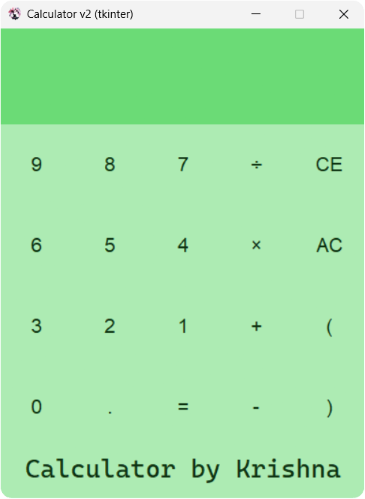

# 🧮 Tkinter Calculator (v2)

An enhanced and visually polished calculator built with Python's Tkinter library — version 2 introduces a modern color scheme, improved input validation, and a live expression history display.



---

## 🚀 Features

- Basic arithmetic operations: `+`, `-`, `×`, `÷`
- Live expression preview (history-like feature)
- Error handling for invalid inputs (e.g., `⚠️ Error`)
- AC (All Clear) and CE (Clear Entry) buttons
- Prevents alphabetical input in the entry field
- Enhanced color scheme and cleaner UI layout

---

## 🛠 Tech Stack

- **Language:** Python 3
- **GUI Library:** Tkinter (comes built-in with Python)

---

## 📥 How to Run

1. Make sure Python is installed on your system.
2. Clone this repository:

```
git clone https://github.com/KrishnaSingh-bit/Calculator-tkinter.git
```

3. Navigate to the project folder and run:

```
cd tkinter-calculator
python calculator.py
```

> 💡 Also, ensure `image.png` (the icon) and `screenshot.png` are placed correctly in the same directory.

---

## 📁 Project Structure

```
📁 tkinter-calculator/
 ┣ 📄 main.py      # Main app file (v2)
 ┣ 📄 README.md          # Project readme (this file)
 ┣ 📷 screenshot.png     # UI image
 ┗ 🖼 image.png           # Window icon for the app
```

---

## 💡 What I Learned

- Managing Tkinter widgets and grid-based layouts
- Input validation using `validatecommand`
- Handling errors with `try/except` inside a GUI context
- Using `StringVar()` and `.trace()` for real-time updates
- Making cleaner, user-friendly UI designs

---

## ✨ Future Ideas

- Keyboard input bindings for faster input
- Add scientific operations (e.g., sin, cos, log)
- Responsive design or fullscreen toggle
- Theme toggle: light/dark modes
- Exporting expression history

---

## 📜 License

This project is open-source under the MIT License.

---

## 🙋‍♂️ About Me

Hi! I'm **Krishna Singh**, a student and aspiring Computer Science engineer.  
This is version 2 of my calculator GUI project — feel free to try it out or share feedback!
